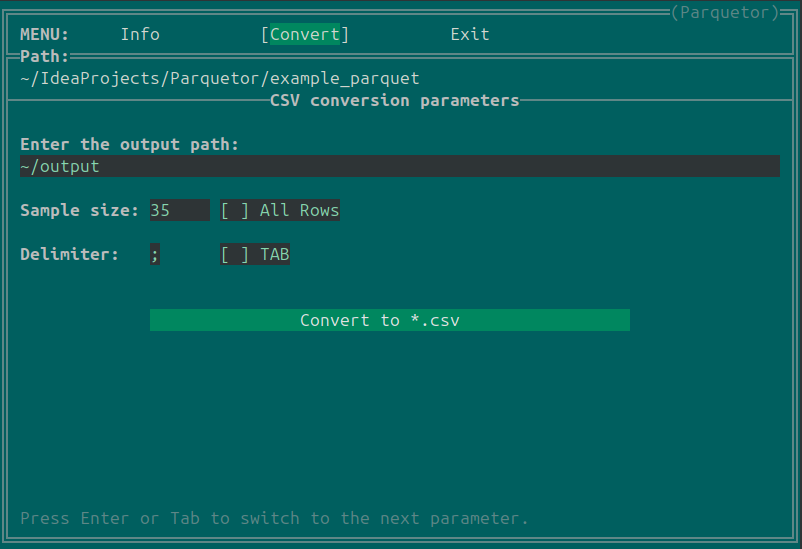
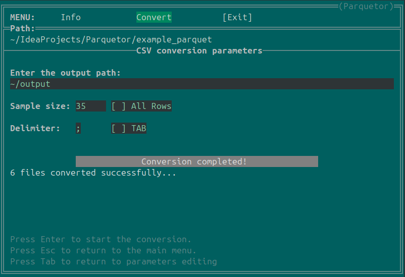

## Оконный интерфейс. Меню "Convert"

**Клавиши навигации:** **[ENTER], [TAB]**  

Окно настройки и исполнения конвертации. В данном окне можно задать параметры ковертации:
- выходную директорию;
- размер сэмпла;
- символ-разделитель.  

  

При нажатии кнопки "Convert to *.csv" производится конвертация файлов, согласно заданным параметрам.  

В результате конвертации в выходной директории будет создан файл **"<имя файла parquet>.csv"** с сэмплом данных
и файл **"<имя файла parquet>.txt"** с отчетом параметров исходного файла **parquet**.
 

