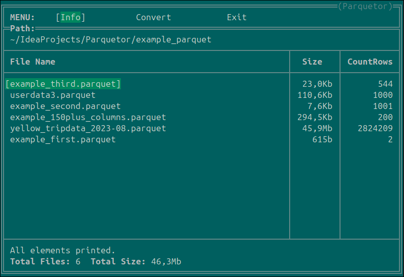
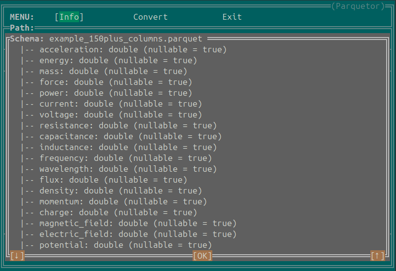

## Оконный интерфейс. Меню "Info"   

**Клавиши навигации:** **[↑], [↓], [ENTER]**  

Окно вывода списка файлов в исходной директории. Выводятся только файлы с расширением .parquet.
В данном окне можно посмотреть список файлов, их размер, и количество записей.    

Также, можно выбрать отдельный файл и посмотреть его схему:  
  
